# xv6-kernel-system-call
How to Add a system call to xv6 kernel

In this project, we add a system call to XV6 kernel that prints a list of running processes (like ps command in linux). Then we write a program that makes five children and waits until all children are finished.
# Install qemu
```
sudo apt-get install qemu-kvm
sudo apt-get install git git clone https://github.com/mit-pdos/xv6-public.git
cd xv6-public 
make qemu-nox
```
Exit qemu and go to your shell:
```
C-a x
```
# How to add a new system call?
1-Add the system call number (22) to syscall.h file

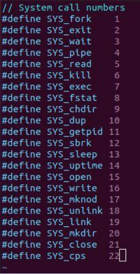

2-Add function prototype to user.h file

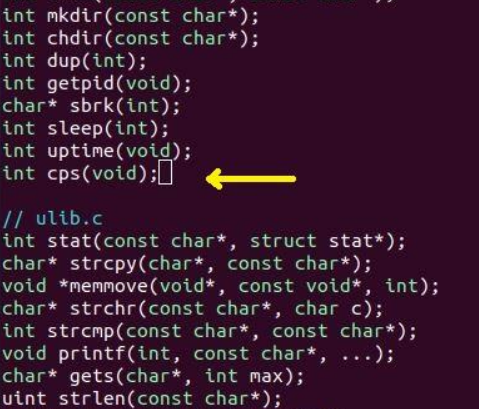

3- Add function prototype to defs.h file

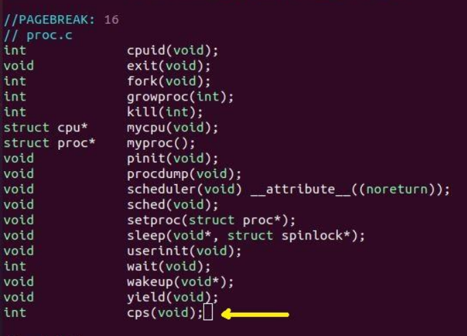

4-Write function body in proc.c

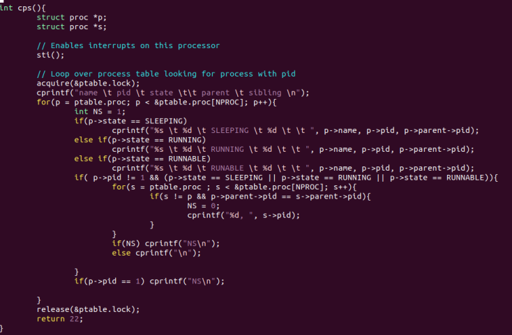

5-Write a function that calls your function in sysproc.c

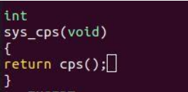

6-write SYSCALL in usys.S

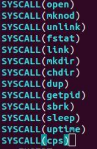

7-Add a pointer and a prototype to syscall.c

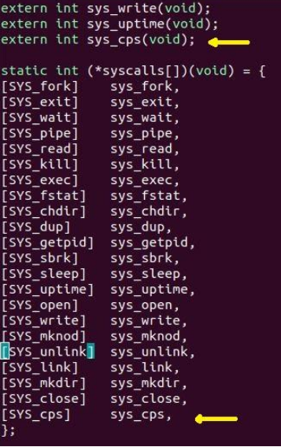

8-Write a C code that calls your function in ps.c

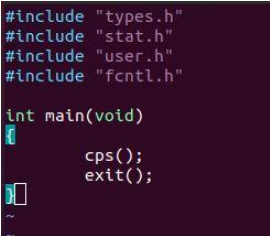

9- Write a C code (dpro.c) to use ps system call

10-change makefile to this:

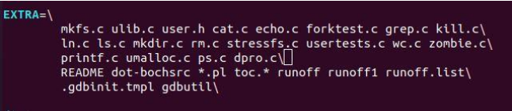
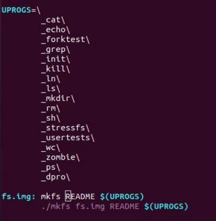

11-Run the commands:
```
Make clean
Make qemu nox
Ps
```
# Result
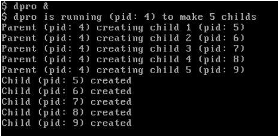
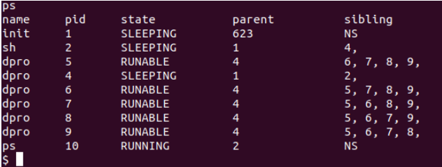

# Project team
[@zamanighazaleh](https://github.com/zamanighazaleh)

[@fatemehazadeh](https://github.com/fatemehazadeh)
